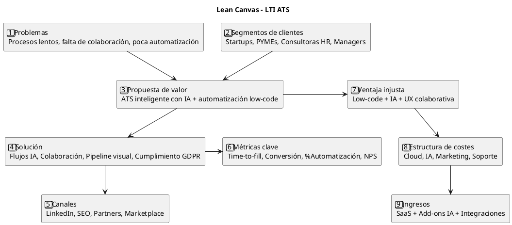
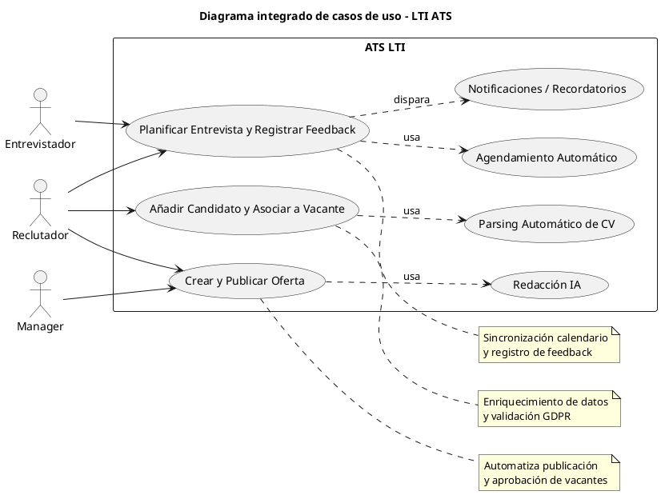
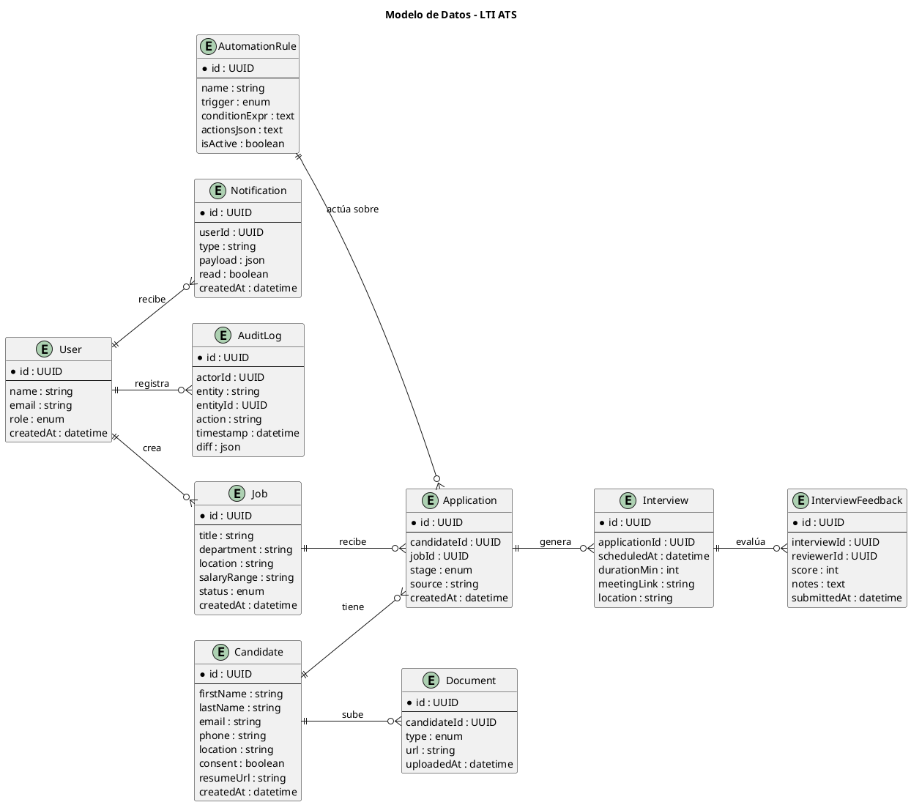
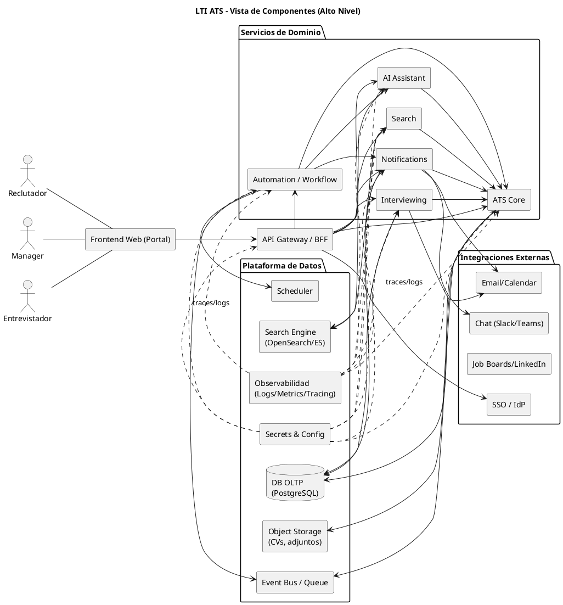

### 1) Descripción breve, valor añadido y ventajas competitivas

**LTI ATS** es una plataforma moderna para gestionar el ciclo de vida del talento: publicación de vacantes, captación y evaluación de candidatos, coordinación de entrevistas y toma de decisiones, con foco en **eficiencia operativa**, **colaboración en tiempo real**, **automatizaciones configurables** y **asistencia de IA** (redacción, matching, resúmenes, feedback coaching).

**Valor añadido**
- Reducir tiempo de cobertura (time-to-fill) con flujos automatizados y plantillas inteligentes.
- Mejorar la calidad de contratación con IA para *matching semántico*, *ranking* y *resúmenes*.
- Colaboración síncrona/asíncrona entre RR.HH. y managers (comentarios, menciones, SLAs).
- Integraciones nativas (correo/calendario, Slack/Teams, LinkedIn, portales de empleo).

**Ventajas competitivas**
- **Automatizaciones low-code/no-code** con reglas y disparadores flexibles.
- **Copiloto de IA** integrado en cada paso (descripciones, cribado, emails, guías de entrevista).
- **Analítica accionable** (embudos, cuellos de botella, DEI, calidad de fuente).
- **Arquitectura modular** apta para escalar y extender integraciones.

---

### 2) Funciones principales

1. **Gestión de vacantes**: creación, plantillas, aprobación, publicación multicanal.  
2. **Gestión de candidatos**: importación, parsing de CV, enriquecimiento, GDPR.  
3. **Aplicaciones**: pipeline Kanban, reglas de transición, notas y etiquetas.  
4. **Entrevistas**: coordinación con calendario, paneles, feedback estructurado.  
5. **Automatizaciones**: disparadores (evento/tiempo), acciones (email, mover etapa, avisos).  
6. **Colaboración**: menciones, comentarios, tareas, SLAs, notificaciones.  
7. **Asistencia IA**: redacción JD, matching, resúmenes, plantillas email.  
8. **Reportes/Analytics**: time-to-fill, fuentes, conversión por etapa, calidad de contratación.  
9. **Integraciones**: SMTP/OAuth Mail, Calendar, Slack/Teams, LinkedIn/Boards, SSO.  
10. **Seguridad**: roles/permisos, auditoría, retención y consentimiento.

---

### 3) Lean Canvas del LTI ATS

| **Bloque** | **Descripción detallada** |
|-------------|----------------------------|
| **1. Problemas** | Procesos lentos, falta de colaboración, escasa automatización, dificultad de evaluación, incumplimiento GDPR. |
| **2. Segmentos de clientes** | Startups, PYMEs, consultoras HR, managers, entrevistadores. |
| **3. UVP** | “ATS inteligente con automatización low-code, colaboración real-time y asistencia IA.” |
| **4. Solución** | Flujos automatizados, IA para redacción/matching, colaboración y pipeline visual. |
| **5. Canales** | LinkedIn, Google Ads, SEO, partners HR, marketplace de integraciones. |
| **6. Métricas clave** | Time-to-fill, % automatización, conversión, NPS, adopción IA. |
| **7. Ventaja injusta** | Low-code + IA + UX colaborativa + arquitectura API-first. |
| **8. Costes** | Cloud, IA, desarrollo, marketing, soporte. |
| **9. Ingresos** | SaaS, add-ons IA, integraciones enterprise, módulos personalizados. |

**Diagrama Lean Canvas (PlantUML):**


---

### 4) Casos de uso principales

## Caso de uso 1 – Crear oferta y publicarla

**Actores:**  
- Reclutador  
- Manager  

**Descripción:**  
El reclutador crea una nueva vacante y utiliza la asistencia de IA para redactar y optimizar su descripción.  
La envía al manager para revisión y aprobación, y una vez validada, el sistema la publica automáticamente en los portales definidos.

**Flujo principal:**  
1. El reclutador selecciona “Nueva vacante”.  
2. Completa los campos requeridos (título, departamento, ubicación, salario).  
3. Usa la IA para mejorar la redacción o sugerir formatos.  
4. Envía la oferta al manager.  
5. El manager revisa, comenta o aprueba.  
6. El sistema publica la vacante en los canales configurados.

**Reglas y excepciones:**  
- Solo reclutadores y managers pueden crear o aprobar ofertas.  
- Las ofertas incompletas no pueden ser publicadas.  
- Si el manager rechaza, la vacante vuelve al estado “Borrador”.

---

## Caso de uso 2 – Añadir candidato y asociarlo a vacante

**Actor:**  
- Reclutador  

**Descripción:**  
Permite registrar o importar candidatos al sistema, analizar su CV automáticamente y asociarlos a una vacante existente.  

**Flujo principal:**  
1. El reclutador abre el módulo “Candidatos”.  
2. Añade un nuevo registro o importa CVs masivos.  
3. El sistema analiza los documentos (parsing automático) y completa los datos.  
4. Solicita consentimiento GDPR al candidato.  
5. El reclutador asocia el candidato a una vacante abierta.  
6. Se genera una aplicación con estado inicial “Applied”.

**Reglas y excepciones:**  
- Requiere correo electrónico válido.  
- Si el candidato ya existe, se sugiere fusión de perfiles.  
- Sin consentimiento GDPR, no se completa el alta.

---

## Caso de uso 3 – Planificar entrevista y registrar feedback

**Actores:**  
- Reclutador  
- Entrevistador  

**Descripción:**  
El reclutador coordina entrevistas entre candidatos y entrevistadores.  
Tras la reunión, el entrevistador completa un formulario de feedback estructurado que se almacena en el sistema.

**Flujo principal:**  
1. El reclutador selecciona un candidato en etapa “Entrevista”.  
2. Consulta disponibilidad de los entrevistadores (sincronización calendario).  
3. Agenda la entrevista y envía invitaciones automáticas.  
4. El entrevistador recibe notificación y prepara la reunión.  
5. Tras la entrevista, completa el formulario de evaluación.  
6. El sistema actualiza el estado del candidato y notifica al reclutador.

**Reglas y excepciones:**  
- Solo los entrevistadores asignados pueden evaluar.  
- Si hay conflicto de horarios, se sugiere reprogramar.  
- Si no se envía feedback en 48 h, se genera recordatorio automático.

---

**Diagrama de casos de uso (PlantUML):**


---

### 5) Modelo de datos (ERD)

El modelo de datos define las **entidades principales**, sus **atributos** y **relaciones** necesarias para soportar los flujos de negocio del sistema LTI ATS.  
Su objetivo es permitir trazabilidad completa del proceso de selección: desde la creación de vacantes hasta la contratación, incluyendo automatizaciones, auditorías y notificaciones.

---

## Entidades y atributos

| **Entidad** | **Atributos (nombre : tipo)** | **Descripción** |
|--------------|-------------------------------|------------------|
| **User** | id: UUID<br>name: string<br>email: string<br>role: enum{Recruiter, Manager, Interviewer, Admin}<br>createdAt: datetime | Representa a un usuario del sistema (reclutador, manager o entrevistador). |
| **Job** | id: UUID<br>title: string<br>department: string<br>location: string<br>salaryRange: string<br>status: enum{Draft, Pending, Open, Closed}<br>createdAt: datetime | Define una oferta de empleo publicada o en preparación. |
| **Candidate** | id: UUID<br>firstName: string<br>lastName: string<br>email: string<br>phone: string<br>location: string<br>consent: boolean<br>resumeUrl: string<br>createdAt: datetime | Representa un candidato con su información personal y consentimiento GDPR. |
| **Application** | id: UUID<br>candidateId: UUID<br>jobId: UUID<br>stage: enum{Applied, Screen, Interview, Offer, Hired, Rejected}<br>source: string<br>createdAt: datetime | Une a un candidato con una vacante, indicando su estado dentro del pipeline. |
| **Interview** | id: UUID<br>applicationId: UUID<br>scheduledAt: datetime<br>durationMin: int<br>meetingLink: string<br>location: string | Información sobre una entrevista programada. |
| **InterviewFeedback** | id: UUID<br>interviewId: UUID<br>reviewerId: UUID<br>score: int<br>notes: text<br>submittedAt: datetime | Evaluación del candidato tras la entrevista. |
| **AutomationRule** | id: UUID<br>name: string<br>trigger: enum{OnStageChange, OnTimeLapse, OnCreate}<br>conditionExpr: text<br>actionsJson: text<br>isActive: boolean | Regla de automatización configurable que ejecuta acciones según eventos o condiciones. |
| **Notification** | id: UUID<br>userId: UUID<br>type: string<br>payload: json<br>read: boolean<br>createdAt: datetime | Notificaciones internas o externas enviadas a los usuarios. |
| **Document** | id: UUID<br>candidateId: UUID<br>type: enum{CV, Portfolio, Other}<br>url: string<br>uploadedAt: datetime | Documentos asociados a un candidato. |
| **AuditLog** | id: UUID<br>actorId: UUID<br>entity: string<br>entityId: UUID<br>action: string<br>timestamp: datetime<br>diff: json | Registro de auditoría con acciones realizadas en el sistema. |

**Diagrama ERD (PlantUML):**


---

### 6) Diseño de alto nivel

**Componentes principales:**  
- **Frontend Web (Portal ATS)**
  - UI para reclutadores, managers y entrevistadores.
  - Colaboración (comentarios, menciones), pipeline Kanban, formularios, feedback.
  - Consumo de APIs y suscripción a eventos en tiempo real.

- **API Gateway / BFF**
  - Autenticación (SSO/OAuth2/OIDC), autorización por roles.
  - Rate-limiting, agregación de respuestas, versión de APIs.
  - Expone endpoints públicos del dominio (Jobs, Candidates, Applications, Interviews, Rules…).

- **Servicios de dominio**
  - **ATS Core**: CRUD Jobs/Candidates/Applications, pipelines, validaciones y reglas de negocio.
  - **Interviewing**: agenda, disponibilidad, invitaciones, feedback estructurado.
  - **Automation/Workflow**: triggers (eventos/tiempo), motor de reglas, orquestación de acciones.
  - **Notifications**: e-mail, chat (Slack/Teams), in-app, recordatorios, SLA.
  - **AI Assistant**: redacción de JD, matching semántico, resúmenes de CV, sugerencia de feedback.
  - **Search**: indexación y búsqueda full-text de candidatos, vacantes y aplicaciones.

- **Plataforma de datos e infraestructura**
  - **DB OLTP** (p.ej., PostgreSQL): transaccional del dominio.
  - **Object Storage**: CVs y adjuntos.
  - **Search Engine** (p.ej., OpenSearch/ES): ranking y filtros.
  - **Event Bus / Queue** (p.ej., Redis/RabbitMQ/Kafka): eventos de dominio y trabajos asíncronos.
  - **Scheduler**: cron/disparadores temporales para reglas y recordatorios.
  - **Observabilidad**: logs centralizados, métricas, trazas distribuidas (OpenTelemetry).
  - **Secrets & Config**: gestión segura de credenciales y configuración.

- **Integraciones externas**
  - **Email/Calendar** (Google/Outlook), **Slack/Teams**, **Job Boards/LinkedIn**, **SSO**.

**Diagrama de componentes (PlantUML):**


---

### 7) C4 – Foco en Automation/Workflow

Esta iteración profundiza en el **servicio de Automatizaciones/Workflow**, responsable de escuchar eventos del dominio, evaluar reglas y **orquestar acciones** (mover etapas, notificar, invocar IA, etc.) de forma fiable y auditable.

---

## C1 – Contexto (resumen)

- **Usuarios:** Reclutadores, Managers, Entrevistadores.
- **Sistemas externos:** Email/Calendar, Slack/Teams, Job Boards, SSO/IdP.
- **Sistema LTI ATS:** Portal Web ↔ API Gateway ↔ Servicios de dominio (Core, Interviewing, Notifications, AI, Search, **Workflow**), BBDD, Bus de eventos.

**Objetivo del servicio Workflow:** automatizar tareas repetitivas y críticas por **evento o tiempo**, garantizando **idempotencia**, **reintentos** y **observabilidad**.

---

## C2 – Contenedores (resumen)

- **Frontend Web** (SPA)  
- **API Gateway/BFF** (AuthN/AuthZ, rate-limit, composición)  
- **Servicios de dominio**: Core, Interviewing, Notifications, AI, Search, **Automation/Workflow**  
- **Plataforma**: DB, Object Storage, **Event Bus/Queue**, Scheduler, Observabilidad, Secrets, Search Engine  
- **Integraciones**: Email/Calendar, Chat, Job Boards, SSO

---

## C3 – Componentes del servicio Automation/Workflow

### Componentes internos y responsabilidades

1. **Trigger Listener**  
   - Suscriptor de **Event Bus** (p.ej., `ApplicationCreated`, `StageChanged`, `InterviewScheduled`).  
   - Recepción de **timers/cron** desde el **Scheduler** (p.ej., “48h sin feedback”).

2. **Rules API (Admin/UI)**  
   - CRUD de reglas (crear, activar, versionar, testear en sandbox).  
   - Validación sintáctica de condiciones.

3. **Rules Store**  
   - Persistencia y versionado de reglas.  
   - Índices por tipo de trigger y ámbito (job/app/candidate/tenant).

4. **Rule Engine**  
   - Evalúa condiciones (atributos, tiempo en etapa, fuente, score IA, expresiones DSL).  
   - Garantiza **idempotencia** por (ruleId, entityId, eventId).

5. **Action Orchestrator**  
   - Ejecuta acciones con **retries**, **DLQ** y **compensaciones** (si aplica).  
   - Control de concurrencia y límites por tenant.

6. **Action Library**  
   - Acciones atómicas: **mover etapa**, **enviar email**, **notificar chat**, **etiquetar**, **invocar IA**, **emitir evento**.

7. **Telemetry & Audit**  
   - Métricas, trazas distribuidas, logs estructurados.  
   - **ExecutionLog** por regla con resultado, latencia y efectos.

---

### Diagrama C3 – Componentes internos (PlantUML)
```plantuml
@startuml
title LTI ATS - Automation/Workflow (C3 - Componentes)
left to right direction
skinparam componentStyle rectangle

' Contexto cercano
component "ATS Core API" as CORE
component "Notifications API" as NOTIF
component "AI Assistant API" as AI
component "Search API" as SEARCH
component "API Gateway / BFF" as APIGW
queue "Event Bus / Queue" as BUS
component "Scheduler" as SCHED
database "Rules Store" as RULES
database "Execution Log" as XLOG
component "Observability\n(Logs/Metrics/Tracing)" as OBS

' Servicio Workflow
package "Automation / Workflow Service" as WF {
  component "Trigger Listener" as TRIG
  component "Rules API (Admin)" as RULES_API
  component "Rule Engine" as ENGINE
  component "Action Orchestrator" as ORCH
  component "Action Library" as LIB
}

' Flujos internos
TRIG --> ENGINE : Eventos / Timers
RULES_API --> RULES : CRUD Reglas
ENGINE --> RULES : Cargar reglas activas
ENGINE --> ORCH : Decisiones (acciones)
ORCH --> LIB : Ejecutar acción/es
ORCH --> XLOG : Registrar ejecución/resultado

' Acciones hacia fuera
LIB --> CORE : Mover etapa / Etiquetar
LIB --> NOTIF : Enviar email / chat
LIB --> AI : Solicitar resumen / sugerencias
LIB --> BUS : Emitir evento de salida
LIB --> SEARCH : Reindexaciones (si aplica)

' Entradas
BUS --> TRIG : Eventos de dominio
SCHED --> TRIG : Triggers de tiempo
APIGW --> RULES_API : Gestión de reglas

' Observabilidad
WF ..> OBS
CORE ..> OBS
NOTIF ..> OBS
AI ..> OBS

@enduml
---

@startuml
title Secuencia: StageChanged → Recordatorio 48h
actor "API Gateway" as APIGW
participant "ATS Core" as CORE
participant "Event Bus" as BUS
participant "Trigger Listener" as TRIG
participant "Rule Engine" as ENG
participant "Action Orchestrator" as ORCH
participant "Action Library" as LIB
participant "Notifications" as NOTIF
participant "Scheduler" as SCHED
database "Rules Store" as RULES
database "Execution Log" as XLOG

APIGW -> CORE : PATCH /applications/{id}/stage = "Interview"
CORE -> BUS : publish StageChanged(appId,"Interview")

BUS -> TRIG : StageChanged
TRIG -> ENG : onEvent(StageChanged)
ENG -> RULES : loadActiveRules
ENG --> ORCH : rule#123 match

ORCH -> LIB : scheduleReminder(48h)
LIB -> SCHED : createTimer(reminder,t+48h)
ORCH -> XLOG : append(ok, rule#123)

... 48h después ...
SCHED -> TRIG : timerFired(reminder)
TRIG -> ENG : onTimer(reminder)
ENG -> RULES : load(rule#123)
ENG --> ORCH : actions: notifyManager,reschedule(24h)
ORCH -> LIB : notifyManager(appId)
LIB -> NOTIF : send(manager,...)
ORCH -> LIB : scheduleReminder(24h)
LIB -> SCHED : createTimer(reminder,t+24h)
ORCH -> XLOG : append(ok, follow-up)

@enduml
---